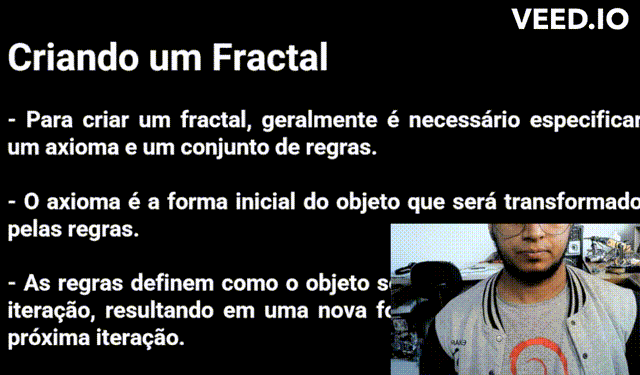

  <h1 align="center">Passador Slides OpenCV </h1>


### Este projeto utiliza a biblioteca OpenCV, juntamente com MediaPipe e Pynput, para criar um passador de slides controlado por gestos. Usamos a detecção de mãos do MediaPipe para identificar a posição dos dedos e os gestos, e o Pynput para controlar as ações do teclado.

> Mão direita gesto 'Positivo' - passa slide (sempre bom deixar a palma da mão para o mediapipe reconheça os dedos)

> Mão esquerda gesto 'Negativo' - volta slide 


>Apenas uma mão pode dar os comandos



# Dependências

### - Python 3.10 🐍
### - OpenCV
### - MediaPipe
### - Numpy
### - Pynput


# Instalação dos Pacotes 🔧

```bash
pip install -r requirements.txt
```

# Executando o jogo ▶️

#### Certifique-se de ter todas as dependências instaladas. Em seguida, você pode executar o script em um terminal.

#### Nota: Este programa usa a webcam para rastrear os gestos das mãos. Certifique-se de que você tenha uma webcam funcionando e acessível.


```bash
python main.py
```

##### Selecione uma webcam, o parâmetro `0` é a câmera default do seu sistema operacional.

```python
cap = cv2.VideoCapture(0) #Selecionar a Webcam
```
##### Para mudar o tamanho da tela do programa

```python
image = cv2.resize(image, None, fx=2, fy=2) #Tamanho da tela: dobro do default
```
##### Aperte `ESC` para sair

```python
cv2.waitKey(5) & 0xFF == 27: #Tecla ESC
```

# Limitações e Melhorias Futuras

##### Este projeto foi criado como uma prova de conceito (PoC) e pode não funcionar perfeitamente em todos os ambientes ou para todos os usuários. Algumas possíveis melhorias e extensões futuras podem incluir:

##### - Aumento da robustez dos gestos de controle, talvez usando uma variedade maior de gestos ou adicionando a capacidade de aprender novos gestos.
##### - Testar e adaptar o programa para funcionar em uma variedade maior de iluminação e fundos.
##### - Adicionar suporte para mais ações, como iniciar ou parar a apresentação de slides, além de simplesmente avançar ou retroceder.


## Contribua 😃

1 - Fork it

2 - Cria sua feature branch (git checkout -b my-new-feature)

3 - Commit suas mudanças (git commit -am "Added some feature")

4 - Push na sua branch (git push origin my-new-feature)

5 - Crie novo Pull Request